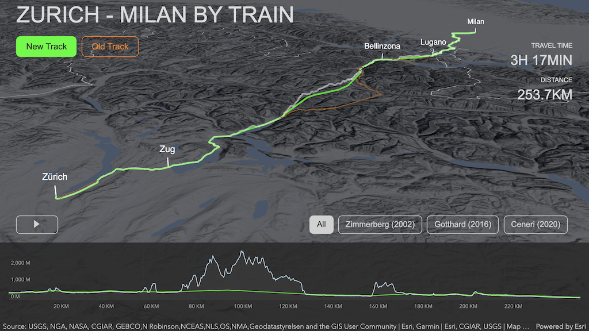

# Zurich - Milan by Train

An interactive 3D web application built with the [ArcGIS API for JavaScript](developers.arcgis.com/javascript/), visualizing the train tracks between Zurich and Milan.

It highlights the new route that originated from the [NEAT](https://en.wikipedia.org/wiki/NRLA) project, together with the time savings resulting from the three major tunnels going through the Swiss alps.

[](https://arnofiva.github.io/neat-train-tracks)

The data for the train tracks has been provided by the [Swiss Federal Railways SBB](https://sbb.ch).

## Code

The app is based on the following technologies:
* [ArcGIS API for JavaScript](developers.arcgis.com/javascript/)
* [Esri Calcite Web](https://esri.github.io/calcite-web/)
* [Webpack](https://webpack.js.org/)
* [GitHub Pages](https://pages.github.com/)

## Running locally

```sh
npm install
npm run start
```

## Deploy using gh-pages

First time, prepare `gh-pages` branch in `./dist` folder:
```sh
git checkout main
git worktree add dist gh-pages
```

```sh
npm run build
cd dist
git add .
git commit -am '🎉'
git push -u origin gh-pages
```

## Licensing

Licensed under the Apache License, Version 2.0 (the "License");
you may not use this file except in compliance with the License.
You may obtain a copy of the License at

   http://www.apache.org/licenses/LICENSE-2.0

Unless required by applicable law or agreed to in writing, software
distributed under the License is distributed on an "AS IS" BASIS,
WITHOUT WARRANTIES OR CONDITIONS OF ANY KIND, either express or implied.
See the License for the specific language governing permissions and
limitations under the License.

A copy of the license is available in the repository's [license.txt](./license.txt) file.